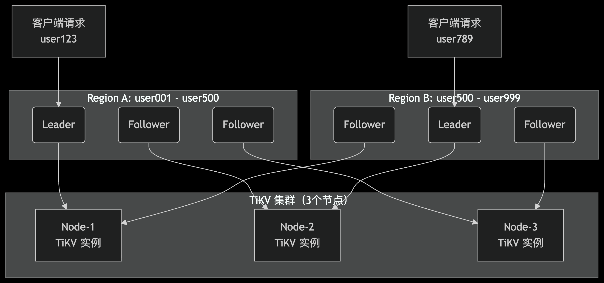

## TiDB 集群主要分为三个组件：
1. TiDB Server
　TiDB Server 负责接收 SQL 请求，处理 SQL 相关的逻辑，并通过 PD 找到存储计算所需数据的 TiKV 地址，与 TiKV 交互获取数据，最终返回结果。 TiDB Server是无状态的，其本身并不存储数据，只负责计算，可以无限水平扩展，可以通过负载均衡组件（如LVS、HAProxy 或F5）对外提供统一的接入地址。
2. PD Server
　Placement Driver (简称 PD) 是整个集群的管理模块，其主要工作有三个： 一是存储集群的元信息（某个 Key 存储在哪个 TiKV 节点）；二是对 TiKV 集群进行调度和负载均衡（如数据的迁移、Raft group leader的迁移等）；三是分配全局唯一且递增的事务 ID。 　　
　PD 是一个集群，需要部署奇数个节点，一般线上推荐至少部署 3 个节点。
3. TiKV Server
　TiKV Server 负责存储数据，从外部看 TiKV 是一个分布式的提供事务的 Key-Value 存储引擎。存储数据的基本单位是 Region，每个 Region 负责存储一个 Key Range （从 StartKey 到EndKey 的左闭右开区间）的数据，每个 TiKV 节点会负责多个 Region 。TiKV 使用 Raft协议做复制，保持数据的一致性和容灾。副本以 Region 为单位进行管理，不同节点上的多个 Region 构成一个 RaftGroup，互为副本。数据在多个 TiKV 之间的负载均衡由 PD 调度，这里也是以 Region 为单位进行调度。

## tikv 是怎么存储的
1. 主键数据 (Row Data)：Key: t_{table_id}_r_{row_id}Value: 这一行所有其他列的数据（username, email, age, created_at）会被编码（如 MsgPack）后放在一起，组成 Value。

示例：id=1, username="alice", email="alice@example.com" 这行数据，在 TiKV 中可能存储为：

Key: t_123_r_1 (假设表ID是123)

Value: ["alice", "alice@example.com", 25, "2023-10-27 10:00:00"]

2. 唯一索引 username (Unique Index)
TiDB 需要支持 WHERE username = 'alice' 的快速查询。
Key: t_{table_id}_i_{index_id}_{index_value} ，index_id: 索引 idx_username 的唯一ID。 index_value: 索引列的值，即 username 的值，如 alice。
Value: 对应行的 row_id（即主键 id=1）。
示例：
Key: t_123_i_567_alice (假设索引ID是567)
Value: 1

3. 数据存在何处 所有这些生成的 Key-Value 对，都被 TiKV 有序地存储在其底层的 RocksDB 实例中。
  1. 排序：RocksDB 中的数据是按 Key 的字典序排列的。这意味着： 同一张表的数据（t_123_r_*）会紧挨在一起。 同一个索引的数据（t_123_i_567_*）也会紧挨在一起。 这种排列方式非常有利于范围查询。

  2. Region 切分： 当这些 KV 数据量增大时，PD 和 TiKV 会自动将整个有序的 Key 空间切分成多个 Region。 例如，t_123_r_1 到 t_123_r_1000 可能在一个 Region 中，t_123_r_1001 到 t_123_r_2000 在下一个 Region 中。 每个 Region 的多个副本（通常是3个）通过 Raft 协议被分布到不同的 TiKV 节点上，实现高可用和负载均衡。

4. 

## tikv 和 region 和 raft
</img>
1. 现在，我们有一张用户表 user，它的所有行数据（假设键为 user001, user002, ... user999）在逻辑上形成了一个连续的整
2. 假设由于数据量较大，TiKV 将这部分用户数据切分成了两个 Region：Region A：负责存储键范围 [user001, user500) 的数据。 Region B：负责存储键范围 [user500, user999] 的数据。
3. PD（Placement Driver，集群的大脑）会决定这 3 个副本分别存放在哪里

| Region  | tikv1 (Node-1) | tikv2 (Node-2) | tikv3 (Node-3) |
|---------|----------------|----------------|----------------|
| RegionA | Leader         | Follower       | Follower       |
| RegionB | Follower       | Leader         | Follower       |

## Redis 和 TiDB 数据都在内存，为什么读取速度不一样？
1. Redis 的读取路径 (GET user:123)：

解析命令 -> 在内存的哈希表中查找键 user:123 -> 找到数据 -> 返回。

极致简单，几乎全是内存操作。

2. TiDB 的读取路径 (SELECT * FROM user WHERE id=123)：

TiDB 层：解析 SQL -> 优化器生成执行计划 -> 确认数据在哪个 Region -> 向该 Region 的 Leader 发起读请求。

TiKV 层（Leader）：

接收请求。 （为保证线性一致） 需要确认自己是否还是合法的 Leader（可能与其他节点通信）。

在内存的 Block Cache 中查找数据。如果找不到，则必须从磁盘（SSD）读取，这会产生毫秒级的延迟。

从数据中解析出多版本信息，返回正确的版本。

TiDB 层：接收返回的数据，可能还要做进一步处理，然后返回给客户端。

路径漫长，涉及网络、磁盘、复杂逻辑。

3. 结论：

Redis 的快，是源于其 “牺牲复杂性/一致性，换取极致速度” 的设计哲学。它是纯内存的、数据结构简单的缓存/存储。

TiDB 的“慢”，是源于其 “用复杂性换取强一致性、SQL功能和横向扩展能力” 的设计哲学。它是一个磁盘为主的、关系型模型的分布式数据库。

它们的内存用途完全不同：Redis 的内存是唯一的数据家园；而 TiDB (TiKV) 的内存仅仅是磁盘的“前台接待区”，目的是为了加速访问，真正的“家”还在磁盘上。